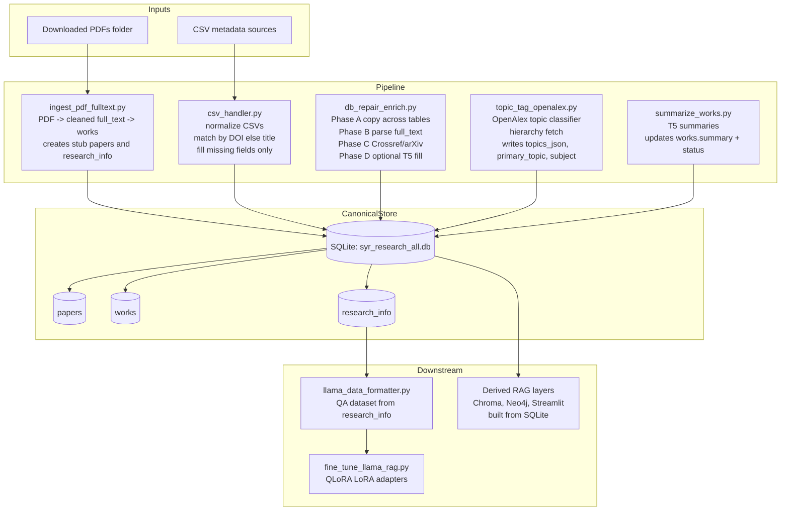

## System Architecture Overview

This codebase implements a deterministic, resumable, single source of truth research ingestion and enrichment pipeline built around SQLite. The system ingests PDFs and CSV metadata, normalizes and repairs paper identity, enriches missing metadata using deterministic parsing and external APIs, assigns OpenAlex topics, and finally summarizes full text for downstream retrieval and model training.

### Core Architectural Principles

**SQLite as the canonical source of truth**

The SQLite database `syr_research_all.db` is the only authoritative data store. No metadata exists only in memory, vector stores, or model artifacts. All downstream systems must be derived from SQLite and can be rebuilt at any time.

**Paper centric data model**

`paper_id` is the stable identity key. All tables reference `paper_id`. This allows metadata to be merged from PDFs, CSVs, parsing, and APIs without duplicating logical papers.

**Non destructive enrichment**

All enrichment steps are additive. Existing non empty values are never overwritten unless explicitly forced. This ensures that higher quality or manually curated data is never destroyed by automated steps.

**Multi phase repair and enrichment**

Instead of a single monolithic repair pass, enrichment is staged into phases with increasing cost and uncertainty.

Phase A deterministic table to table copying

Phase B deterministic full text parsing

Phase C external API enrichment

Phase D optional LLM based extraction

**Separation of concerns**

Each script has a single responsibility and can be run independently. `run_pipeline.py` only orchestrates ordering and does not contain business logic.

## Data Model and Table Responsibilities

### papers

Represents paper identity. One row per logical paper.

**Fields**

`paper_id` primary key

`title` canonical title

`authors` canonical author list

`publication_date` year or date string

`doi` canonical DOI normalized

`arxiv_id` canonical arXiv identifier

**Invariant**

`papers` should never contain duplicate DOI or arXiv identifiers across rows.

### works

Represents physical documents and text content.

**Fields**

`id` primary key

`paper_id` foreign key to papers

`file_name` PDF filename

`full_text` extracted and cleaned text

`summary` T5 generated summary

`summary_status` unsummarized or summarized

`progress` integer used as simple state flag

**Invariant**

`works` is the only table allowed to store full text. One paper may have multiple works rows in theory, but the pipeline assumes one dominant PDF per paper.

### research_info

Represents presentation and enrichment metadata.

**Fields**

`paper_id` primary key

`work_title` display title

`authors` display authors

`doi` display DOI

`publication_date` display date

`researcher_name` primary researcher inferred

`info` free form concatenated metadata

`topics_status` untagged or tagged

`topics_json` full OpenAlex topic output

`primary_topic` primary topic name only

`subject` coarse one word subject

**Invariant**

`research_info` mirrors `papers` where possible but may include derived or user facing fields not appropriate for `papers`.

## Pipeline Execution Flow

### Canonical Execution Order

1 ingest_pdf_fulltext.py

2 csv_handler.py

3 db_repair_enrich.py

4 topic_tag_openalex.py

5 summarize_works.py

`run_pipeline.py` enforces this order and passes optional limits and flags.

## File by File and Function Level Documentation

## run_pipeline.py

**Purpose**

Acts as the orchestration layer. It enforces ordering, validates database existence, and delegates real work to other modules.

**Functions**

`_assert_db_exists` checks that the SQLite database file exists before running any step and prevents silent creation of a new empty database.

`_quick_db_ping` opens a connection and runs a trivial query to verify the database is readable and not corrupted.

`main` parses CLI arguments and executes each pipeline stage conditionally.

**Execution Logic**

Step 1 always runs ingest_pdf_fulltext

Step 2 runs csv_handler unless skipped

Step 3 runs db_repair_enrich as a subprocess to isolate memory heavy operations

Step 4 runs topic_tag_openalex as a subprocess

Step 5 runs summarize_works unless skipped

**Design Rationale**

db_repair_enrich and topic_tag_openalex are executed via subprocess to ensure GPU memory and model state are fully released between steps.

## ingest_pdf_fulltext.py

**Purpose**

Transforms downloaded PDFs into structured rows in works and creates placeholder identity rows in papers and research_info.

**Key Functions**

`_ensure_pragmas` enables WAL mode and relaxed sync for faster bulk inserts.

`_work_exists` checks if a PDF file_name already exists in works and prevents duplicate ingestion.

`_create_paper` inserts a minimal empty row into papers and returns paper_id to establish identity early.

`_insert_work` inserts a works row with full_text and unsummarized status.

`_has_column` detects schema differences safely.

`_try_insert_research_info_stub` optionally inserts a stub research_info row early for join consistency.

`main` iterates over all PDFs, extracts and cleans text, creates papers and works rows, and optionally inserts research_info stubs.

**Failure Handling**

Extraction and insertion failures are isolated per file so one bad PDF does not halt the pipeline.

## pdf_pre.py

**Purpose**

Low level PDF extraction and cleaning utilities.

**Functions**

`extract_raw_text_from_pdf` reads each page using PyPDF2 and returns concatenated text.

`clean_text` normalizes whitespace and removes unstable punctuation while preserving technical content.

`extract_research_info_from_pdf` heuristic extractor for title and authors, currently experimental.

## csv_handler.py

**Purpose**

Ingests external CSV metadata and enriches papers and research_info without overwriting existing data.

**Key Concepts**

CSV schemas are heterogeneous and unreliable. All inputs are normalized into a common internal representation before touching the database.

**Functions**

`_norm` normalizes strings

`_norm_doi` extracts and canonicalizes DOI strings

`_safe_str` converts pandas values safely

`combine_csvs` normalizes schemas and concatenates all CSV inputs

`_find_paper_id` matches papers by DOI then exact title

`_create_paper` creates a new papers row if no match exists

`_ensure_research_info_row` guarantees research_info presence

`_fill_papers_missing` fills missing canonical fields using COALESCE logic

`_fill_research_info_missing` fills missing presentation fields and builds info strings

`populate_research_info_from_csv` is the main orchestration entry point

**Architectural Role**

This module bridges external curated metadata into the canonical SQLite dataset.

## database_handler.py

**Purpose**

Minimal helper functions for summarization workflows.

**Functions**

`fetch_unsummarized_works` returns works rows ready for summarization

`update_summary` writes summary text and status

`close_connection` retained for backward compatibility

## summarize_works.py

**Purpose**

Runs T5 summarization over works.full_text.

**Behavior**

Summarization is sequential and conservative to avoid GPU memory spikes and ensure deterministic progress tracking.

## model.py

**Purpose**

Encapsulates all T5 model logic.

**Functions**

`load_t5_model` loads t5 small and tokenizer

`clear_memory` releases CUDA memory

`summarize_text` truncates input and generates summaries

`fine_tune_t5_on_papers` fine tunes T5 on paper data

## db_audit.py

**Purpose**

Audits database health and schema consistency.

**Functions**

Includes table listing, column inspection, NULL counts, empty string checks, sampling, and cross table integrity checks.

**Architectural Role**

Diagnostic and validation tool only, not part of pipeline execution.

## db_repair_enrich.py

**Purpose**

Central repair and enrichment engine implementing layered trust.

**Phase A**

Copies best available values across tables, extracts arXiv IDs from filenames, and enforces identifier uniqueness.

**Phase B**

Deterministic full text parsing to extract title, authors, year, DOI, arXiv ID, researcher name, and info.

**Phase C**

External enrichment using Crossref and arXiv APIs.

**Phase D**

Optional Flan T5 extraction for remaining title, authors, and year only.

**Safeguards**

Strict JSON parsing, year validation, dummy title rejection, and email detection in author strings.

## topic_tag_openalex.py

**Purpose**

Assigns research topics using an OpenAlex trained classifier.

**Behavior**

Writes topics_json, primary_topic name only, topics_status, and subject into research_info.

## fine_tune_llama_rag.py

**Purpose**

Fine tunes a local LLaMA model using LoRA adapters for downstream RAG usage.

**Architectural Role**

Consumes outputs from the SQLite pipeline and remains decoupled from ingestion.

## llama_data_formatter.py

**Purpose**

Generates QA training data from research_info.

## Pipeline Architecture Flow



## Folder Structure

```
pipeline_project/

run_pipeline.py
ingest_pdf_fulltext.py
csv_handler.py
db_repair_enrich.py
topic_tag_openalex.py
summarize_works.py
database_handler.py
model.py
pdf_pre.py
pdfs.py
llama_data_formatter.py
fine_tune_llama_rag.py
db_audit.py
```

## What Changed From the Previous Approach

### Explicit staged orchestration

The previous approach relied on a monolithic `train_pipeline.py` that attempted to ingest data, repair metadata, summarize text, generate datasets, and fine tune models in a single run. The current design separates ingestion, CSV enrichment, repair, topic tagging, and summarization into explicit scripts coordinated only by `run_pipeline.py`.

This improves resumability, failure isolation, and allows individual stages to be rerun safely without retraining models.

### Canonical dataset before retrieval

Earlier versions treated vector stores and RAG pipelines as first class outputs. The current architecture delays any retrieval layer until the SQLite dataset is fully repaired, enriched, and topic tagged. Chroma, Neo4j, or Streamlit services are now derived artifacts.

This prevents vector stores from becoming accidental sources of truth and guarantees deterministic rebuilds.

### Layered trust enrichment model

Metadata enrichment is now explicitly ordered by trust and cost. Existing values are copied first, deterministic parsing is applied second, authoritative external APIs are queried third, and language models are used only as a last resort.

This minimizes hallucination risk and protects high quality curated metadata.

### Strict non destructive updates

All scripts enforce COALESCE and NULL checks to ensure that non empty values are never overwritten unless explicitly forced. Identifier uniqueness for DOI and arXiv IDs is enforced across the dataset.

This makes the database auditable and stable across repeated pipeline runs.

### Topics as a first class semantic index

Topic tagging has moved from an optional enhancement to a canonical database feature. OpenAlex topics, ranked metadata, and normalized primary topics are stored directly in `research_info`.

This enables semantic routing, grant matching, and structured retrieval without relying solely on embeddings.

### Summarization as a downstream enhancement

Summarization is now executed after identity repair and topic tagging. Summaries are treated as an additional retrieval signal rather than a repair mechanism.

### Decoupled RAG and service layers

Interactive RAG services and tests are no longer coupled to ingestion. The pipeline produces a high quality canonical dataset usable for chatbots, analytics, exports, and institutional matching workflows.

## Summary

This system is a SQLite first research ingestion and enrichment pipeline designed for correctness, reproducibility, and long term maintainability. Every stage is isolated, restartable, and defensive. Metadata flows inward from PDFs, CSVs, deterministic parsing, authoritative APIs, and finally language models. At no point is existing data destroyed or silently replaced.

