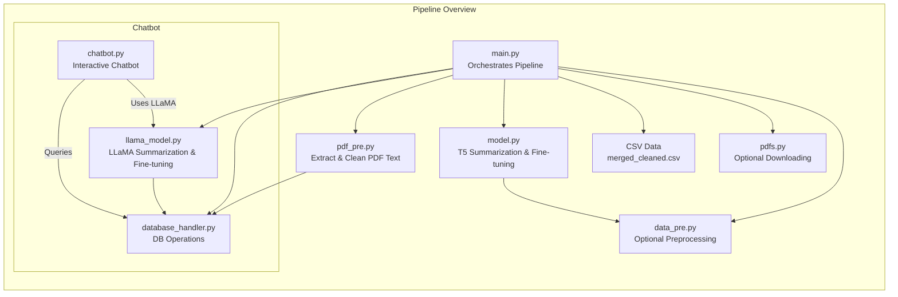

# Pipeline Overview

This pipeline is designed to process research PDFs and researcher data to build a database, generate summaries using a T5 model, and fine‑tune both T5 and LLaMA models on the summarized data. A chatbot is also provided that queries researcher information from the database to answer subject‑specific queries. The pipeline is checkpoint‑aware, so both the T5 and LLaMA models resume training from the latest checkpoint.

---

# Folder Structure
pipeline_project/
├── main.py

├── pdfs.py 

├── pdf_pre.py

├── model.py

├── database_handler.py

├── data_pre.py

└── chatbot.py

- **main.py:** Orchestrates the entire pipeline. It populates the database from PDFs, loads researcher info from a CSV file, generates summaries, and fine‑tunes both T5 and LLaMA models.
- **pdfs.py:** Contains functionality to download PDFs from a CSV source (if used in your pipeline).
- **pdf_pre.py:** Provides functions to extract and clean text from PDF files and extract researcher information using basic heuristics.
- **model.py:** Contains functions for generating summaries using the T5 model and fine‑tuning the T5 model on research papers. It supports checkpoint resumption.
- **database_handler.py:** Manages all database operations, including creating and populating two tables: `works` for PDF content and `research_info` for researcher records.
- **data_pre.py:** Provides a helper function to preprocess text for T5 summarization.
- **chatbot.py:** Implements an interactive chatbot that queries the `research_info` table for researcher information and returns formatted results.

---

# Detailed File and Function Documentation

## 1. data_pre.py

### Purpose
Prepares raw text for input into the T5 summarization model.

### Function

- **`preprocess_text_for_t5(text, model_name="t5-small")`**
  - **Description:**  
    Adds a task prefix ("summarize: ") to the input text, truncates it to the first 1000 characters, and tokenizes it using the T5 tokenizer.
  - **Parameters:**
    - `text` (str): The raw input text.
    - `model_name` (str): Name of the T5 model to use; default is `"t5-small"`.
  - **Returns:**  
    A tokenized representation of the input text with a fixed maximum length (512 tokens).

---

## 2. database_handler.py

### Purpose
Handles all interactions with the SQLite database. The database contains two main tables:

- **`works` table:** Stores information about PDFs (filename, extracted text, summaries, and progress flags).
- **`research_info` table:** Stores detailed researcher records (researcher name, work title, authors, and additional information).

### Functions

- **`setup_database()`**
  - **Description:**  
    Creates the `works` table if it does not already exist.
  - **Returns:**  
    None.

- **`remove_duplicates()`**
  - **Description:**  
    Removes duplicate entries in the `works` table based on the `file_name` column.
  - **Returns:**  
    None.

- **`insert_work(file_name, full_text, summary=None, summary_status="unsummarized", progress=0)`**
  - **Description:**  
    Inserts a record into the `works` table. Uses a unique constraint on `file_name` to avoid duplicates.
  - **Parameters:**
    - `file_name` (str): The name of the PDF file.
    - `full_text` (str): The extracted text from the PDF.
    - `summary` (str, optional): Summary of the work.
    - `summary_status` (str): Status flag (defaults to `'unsummarized'`).
    - `progress` (int): A flag indicating processing progress (default is 0).

- **`fetch_unsummarized_works(limit=None)`**
  - **Description:**  
    Retrieves all records from the `works` table that have not been summarized.
  - **Parameters:**
    - `limit` (int, optional): Limit on the number of records to fetch.
  - **Returns:**  
    A list of tuples, each containing `(id, full_text)`.

- **`update_summary(work_id, summary)`**
  - **Description:**  
    Updates a work’s summary and marks it as summarized in the `works` table.
  - **Parameters:**
    - `work_id` (int): The database ID for the work.
    - `summary` (str): The generated summary.

- **`count_entries_in_table(table_name="works")`**
  - **Description:**  
    Returns the count of rows in a specified table.
  - **Parameters:**
    - `table_name` (str): Name of the table (defaults to `"works"`).
  - **Returns:**  
    An integer count of entries.

- **`check_missing_files_in_db(pdf_files)`**
  - **Description:**  
    Given a list of PDF file names, checks which ones are not present in the `works` table.
  - **Parameters:**
    - `pdf_files` (list): List of PDF filenames.
  - **Returns:**  
    A set of filenames that are missing from the database.

- **`setup_research_info_table()`**
  - **Description:**  
    Creates the `research_info` table if it does not already exist. This table stores researcher information.
  - **Returns:**  
    None.

- **`insert_research_info(researcher_name, work_title, authors, info)`**
  - **Description:**  
    Inserts a new researcher record into the `research_info` table.
  - **Parameters:**
    - `researcher_name` (str): The primary researcher’s name.
    - `work_title` (str): Title of the work.
    - `authors` (str): List of authors.
    - `info` (str): Additional information (e.g., DOI, publication date).
  
- **`fetch_research_info()`**
  - **Description:**  
    Retrieves all records from the `research_info` table.
  - **Returns:**  
    A list of tuples for each record.

- **`close_connection()`**
  - **Description:**  
    Closes the database connection.
  - **Returns:**  
    None.

---

## 3. pdf_pre.py

### Purpose
Provides functionality to extract and clean text from PDF files and extract researcher information using basic heuristics.

### Functions

- **`extract_text_from_pdf(file_path)`**
  - **Description:**  
    Reads a PDF file, concatenates text from each page, and returns a cleaned version of the text.
  - **Parameters:**
    - `file_path` (str): Path to the PDF file.
  - **Returns:**  
    Cleaned text as a string or `None` on failure.

- **`clean_text(text)`**
  - **Description:**  
    Removes extra whitespace and unwanted characters from the extracted text.
  - **Parameters:**
    - `text` (str): Raw extracted text.
  - **Returns:**  
    A cleaned string.

- **`extract_research_info_from_pdf(file_path)`**
  - **Description:**  
    Uses basic heuristics to extract researcher information from a PDF.
    - Assumes the first line is the work title.
    - Looks for lines starting with “Author:” or “Authors:” to extract author names.
    - The first author is assumed to be the primary researcher.
  - **Parameters:**
    - `file_path` (str): Path to the PDF file.
  - **Returns:**  
    A dictionary with keys: `researcher_name`, `work_title`, `authors`, and `info` (first 1000 characters of the text), or `None` if extraction fails.

---

## 4. model.py

### Purpose
Contains functions for generating summaries using a T5 model and for fine-tuning T5 on research papers. Supports checkpoint resumption.

### Functions

- **`clear_memory()`**
  - **Description:**  
    Clears GPU and CPU memory by emptying CUDA cache and running garbage collection.
  - **Returns:**  
    None.

- **`summarize_text(text, idx=None, total=None)`**
  - **Description:**  
    Generates a summary for the input text using the T5 model. The text is truncated to 1000 characters, prefixed with "summarize:", tokenized, and then summarized.
  - **Parameters:**
    - `text` (str): The text to be summarized.
    - `idx` (int, optional): Current index (for logging).
    - `total` (int, optional): Total number of texts (for logging).
  - **Returns:**  
    A generated summary as a string.

- **`fine_tune_t5_on_papers(dataset, output_dir=r"C:\codes\t5-db\fine_tuned_t5")`**
  - **Description:**  
    Fine-tunes the T5 model on a dataset of research papers.
    - Tokenizes the input texts and summaries.
    - Sets up training arguments.
    - Resumes training from the latest checkpoint if one exists.
  - **Parameters:**
    - `dataset` (pandas DataFrame): Must contain `input_text` and `summary` columns.
    - `output_dir` (str): Directory to save the fine-tuned model.
  - **Returns:**  
    The output directory where the model is saved.

---

## 5. llama_model.py

### Purpose
Provides functions for using the LLaMA model for inference (chatbot) and for fine-tuning on research data. Supports checkpoint resumption.

### Functions

- **`clear_memory()`**
  - **Description:**  
    Clears GPU and CPU memory.
  - **Returns:**  
    None.

- **`chatbot_answer(question)`**
  - **Description:**  
    Generates an answer for the given research question using the LLaMA model.
    - Constructs a prompt instructing the model to act as a knowledgeable research assistant.
    - Tokenizes the prompt and generates an answer.
    - Post-processes the output to ensure a clean answer.
  - **Parameters:**
    - `question` (str): The research question.
  - **Returns:**  
    A generated answer as a string.

- **`fine_tune_llama_on_papers(dataset, output_dir=FINE_TUNED_MODEL_PATH)`**
  - **Description:**  
    Fine-tunes the LLaMA model on a dataset of research papers.
    - The dataset must include `input_text` and `target_text` columns (where `target_text` is typically the summary).
    - Tokenizes the combined prompt and target text, masking out prompt tokens so that loss is computed only on the target.
    - Resumes training from the latest checkpoint if available.
  - **Parameters:**
    - `dataset` (pandas DataFrame): Contains `input_text` and `target_text` columns.
    - `output_dir` (str): Directory where the fine-tuned model will be saved.
  - **Returns:**  
    The output directory where the fine-tuned model is saved.

*Note: The variable `FINE_TUNED_MODEL_PATH` should be defined (in the environment or in `main.py`) and points to where the fine-tuned LLaMA model is saved.*

---

## 6. chatbot.py

### Purpose
Implements an interactive chatbot that serves as a subject matter expert. It queries the `research_info` table for matching researcher records and returns formatted details.

### Functions

- **`get_research_info(query, db_path=r"C:\codes\t5-db\researchers.db")`**
  - **Description:**  
    Queries the `research_info` table for records where `researcher_name`, `work_title`, or `authors` contain the query substring (case‑insensitive).
  - **Parameters:**
    - `query` (str): The user's query.
    - `db_path` (str): Path to the database.
  - **Returns:**  
    A formatted string of matching records if found, or `None`.

- **`run_chatbot()`**
  - **Description:**  
    Runs an interactive loop that accepts user input.
    - Responds to greetings with a friendly message.
    - For other queries, it uses `get_research_info()` to find matching records and displays the results, or “Not found” if no match is detected.
  - **Returns:**  
    None.

---

## 7. main.py

### Purpose
Acts as the main orchestrator for the entire pipeline. It executes the following steps in order:

1. **Populate the `works` Table from PDFs:**
   - Reads all PDF files from a designated folder.
   - Extracts full text using `extract_text_from_pdf()`.
   - Inserts records into the `works` table.

2. **Populate the `research_info` Table from CSV:**
   - Reads researcher data from a CSV file (`merged_cleaned.csv`).
   - Extracts relevant fields (e.g., `author_name`, `title`, `doi_url`, etc.).
   - Inserts records into the `research_info` table.

3. **Generate Summaries:**
   - Retrieves unsummarized works from the `works` table.
   - Generates summaries using the T5 model.
   - Updates the records in the database.

4. **Fine-tune the T5 Model:**
   - Uses the summarized data to fine-tune the T5 model.
   - Resumes training from the latest checkpoint if available.

5. **Fine-tune the LLaMA Model:**
   - Uses the same summarized data (after renaming columns appropriately) to fine-tune the LLaMA model.
   - Resumes training from the latest checkpoint if available.

### Functions

- **`clear_memory()`**
  - **Description:**  
    Clears GPU and CPU memory.
  - **Returns:**  
    None.

- **`populate_database_from_pdfs()`**
  - **Description:**  
    Processes all PDF files in the specified folder, extracts their full text, and inserts records into the `works` table.
  - **Returns:**  
    None.

- **`populate_research_info_from_csv()`**
  - **Description:**  
    Reads the CSV file (`merged_cleaned.csv`), extracts researcher information (using columns such as `author_name`, `title`, etc.), and inserts records into the `research_info` table.
  - **Returns:**  
    None.

- **`generate_summaries_for_database()`**
  - **Description:**  
    Retrieves unsummarized works from the database and generates summaries using the T5 model. Updates the records accordingly.
  - **Returns:**  
    None.

- **`fine_tune_model_on_summaries()`**
  - **Description:**  
    Fine-tunes the T5 model on the summarized data (from the `works` table), resuming from the latest checkpoint if one exists.
  - **Returns:**  
    None.

- **`fine_tune_llama_model_on_summaries()`**
  - **Description:**  
    Fine-tunes the LLaMA model on the summarized data (after renaming columns appropriately), resuming from the latest checkpoint if one exists.
  - **Returns:**  
    None.

### Main Execution Block

When executed, `main.py` calls each function in sequence. Finally, the database connection is closed, and a completion message is printed.

---

# Dependency Diagram

How to Run the Pipeline
Folder Setup:
Place all files into a directory (e.g., pipeline_project).

Run the Pipeline:
Open a terminal, navigate to the folder, and execute:

python main.py
This will:

Populate the works table from PDFs.
Populate the research_info table from merged_cleaned.csv.
Generate summaries for unsummarized works.
Fine-tune the T5 model on summarized data (resuming from the latest checkpoint if available).
Fine-tune the LLaMA model on summarized data (resuming from the latest checkpoint if available).
Run the Chatbot:
To start the interactive chatbot, execute:

python chatbot.py
The chatbot queries the research_info table and returns formatted researcher information if found.

