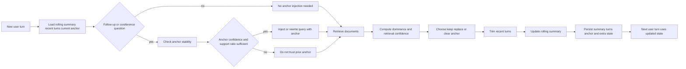
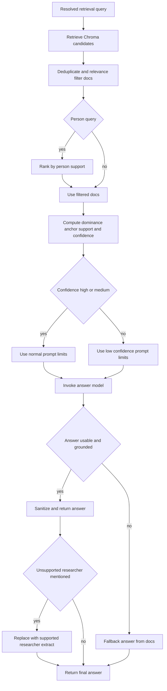

# Syracuse Research Assistant

A local retrieval augmented generation application for Syracuse research discovery. The repository ingests paper records from SQLite into Chroma, retrieves and filters evidence, tracks short term conversational state across turns, and serves answers through a Streamlit chat interface. It also includes an optional graph view that turns retrieved papers into a lightweight entity relationship network.

This README is intentionally code aware. It explains how the repository works, what each major module does, how the main functions contribute to the pipeline, and how data moves from ingestion to answer generation.

## Table of contents

1. Project summary
2. Main capabilities
3. Repository structure
4. End to end flow
5. File by file technical reference
6. Retrieval behavior
7. Data contracts
8. Setup and local execution
9. Runtime operations
10. Strengths and limitations
11. Recommended next improvements

## Project summary

At a practical level, the application solves four problems:

1. It converts paper metadata, summaries, and full text stored in SQLite into Chroma documents with normalized metadata.
2. It retrieves relevant paper chunks for a user question, with additional logic for follow ups, person centered questions, anchor stability, and retrieval confidence.
3. It maintains a rolling summary and recent turns so follow up questions can be resolved without losing topic continuity.
4. It renders the interaction in Streamlit, including retrieved sources, diagnostics, and an optional relationship graph.

## Main capabilities

### Retrieval first, generation second

The system is built so retrieval drives the answer path. The prompt instructs the answer model to stay grounded in the Syracuse research corpus, and several downstream checks downgrade or replace unsafe answers when retrieval is weak.

### Conversation continuity through anchors

The system tracks a current anchor, which is the dominant subject inferred from recent retrieval and conversation state. Short or pronoun based follow ups can be interpreted relative to that anchor when evidence is strong enough.

### Weak evidence handling

The code distinguishes between confident retrieval, weak retrieval, and inconsistent retrieval. When evidence quality drops, the prompt is narrowed, the guardrails become stricter, and the pipeline can fall back to safer extractive answers.

### Local friendly runtime behavior

The repository is designed for local model paths, persistent Chroma storage, offline friendly execution, and explicit cache and session reset controls.

## Repository structure

```text
.
|-- cache_manager.py
|-- chroma_ingest.py
|-- config_full.py
|-- config_graph.py
|-- conversation_memory.py
|-- database_manager.py
|-- rag_engine.py
|-- rag_graph.py
|-- rag_pipeline.py
|-- rag_utils.py
|-- runtime_settings.py
|-- session_store.py
`-- streamlit_app.py
```

## End to end flow


```mermaid
flowchart TD
    U[User submits question in Streamlit] --> UI1[streamlit_app.py appends user message to UI session]
    UI1 --> P0[rag_pipeline.answer_question]

    P0 --> V1[Validate question and detect meta command cases]
    V1 --> M1[get_global_manager and runtime settings]
    M1 --> S1[Load persistent session state from SessionStore]
    S1 --> S2[Read rolling summary recent turns extra state and current anchor]
    S2 --> C1[Build state signature and cache inputs]
    C1 --> C2{Cacheable turn and cached answer exists}
    C2 -->|yes| RETCACHE[Return cached payload to UI]
    C2 -->|no| I1[Classify broad intent and summary intent]

    I1 --> F1[Detect follow up or coreference query]
    F1 --> F2{Short query pronoun query or follow up phrase}
    F2 -->|yes| A1[Inspect current anchor and rolling summary]
    F2 -->|no| Q1[Use original question as retrieval basis]

    A1 --> A2{Anchor stable and supported enough}
    A2 -->|yes| Q2[Inject anchor or rewrite retrieval text]
    A2 -->|no| Q1

    Q1 --> R0[Build retrieval query text]
    Q2 --> R0

    R0 --> R1[rag_engine retrieval path starts]
    R1 --> R2[Open active Chroma collection for current mode]
    R2 --> R3[Run vector retrieval with search_k and fetch_k budgets]
    R3 --> R4{Dual query or expanded follow up retrieval enabled}
    R4 -->|yes| R5[Run secondary retrieval path and merge candidates]
    R4 -->|no| R6[Continue with initial candidates]
    R5 --> D0
    R6 --> D0

    D0[Deduplicate candidate docs by paper and chunk] --> D1[Build document haystacks and normalize metadata]
    D1 --> D2[Filter noisy docs using relevance tokens from the question]
    D2 --> P1{Person centered query detected}

    P1 -->|yes| P2[Extract person name from question]
    P2 --> P3[Build name signatures and score docs for person support]
    P3 --> P4[Rank docs by person match strength]
    P4 --> P5[Select person focused subset]
    P5 --> G0

    P1 -->|no| G0[Proceed with filtered docs]

    G0 --> G1[Analyze metadata dominance across retrieved docs]
    G1 --> G2[Estimate anchor support ratio across retrieved set]
    G2 --> G3[Assign retrieval confidence label]
    G3 --> G4{Weak or inconsistent retrieval}

    G4 -->|yes| G5[Downshift confidence and reduce prompt doc limits]
    G4 -->|no| G6[Keep normal prompt budget]

    G5 --> AN1[Build candidate anchor from dominance analysis]
    G6 --> AN1

    AN1 --> AN2[Choose whether to keep replace or ignore anchor]
    AN2 --> CTX1[Build rolling summary block for prompt]
    CTX1 --> CTX2[Build recent turns context block]
    CTX2 --> CTX3[Build compact context from retrieved docs]
    CTX3 --> CTX4[Fit document context to runtime token budget]

    CTX4 --> PR1[Compose grounded answer prompt]
    PR1 --> LLM1[Invoke answer model with timeout guard]
    LLM1 --> LLM2{Model returned usable answer}

    LLM2 -->|no| FB1[Fallback answer from retrieved docs]
    LLM2 -->|yes| SAN1[Sanitize raw answer text]

    SAN1 --> SAN2[Remove prompt leak labels and process narration]
    SAN2 --> SAN3{Answer mentions unsupported researchers}
    SAN3 -->|yes| FB2[Replace with supported researcher extract answer]
    SAN3 -->|no| SAN4[Keep sanitized answer]

    FB1 --> OUT1[Final answer selected]
    FB2 --> OUT1
    SAN4 --> OUT1

    OUT1 --> SUM1[Update rolling summary from question retrieval metadata and answer]
    SUM1 --> SUM2{LLM summary regeneration enabled}
    SUM2 -->|yes| SUM3[Optionally regenerate summary with utility model then normalize]
    SUM2 -->|no| SUM4[Keep deterministic summary update]
    SUM3 --> ST1[Trim turns sanitize extra state and persist session]
    SUM4 --> ST1

    ST1 --> ST2[Store updated turns summary anchor and retrieval confidence]
    ST2 --> GC1{Graph mode enabled}
    GC1 -->|yes| GC2[rag_graph.graph_retrieve_from_paper_docs]
    GC1 -->|no| PKG1[Build output payload without graph]

    GC2 --> GC3[Convert retrieved docs to graph hits]
    GC3 --> GC4[Create paper researcher author and topic nodes]
    GC4 --> GC5[Create graph edges and graph payload]
    GC5 --> PKG2[Build output payload with graph]

    PKG1 --> CACHE1{Turn should be cached}
    PKG2 --> CACHE1
    CACHE1 -->|yes| CACHE2[Write QA cache and pipeline cache]
    CACHE1 -->|no| UI2[Return payload to Streamlit]
    CACHE2 --> UI2

    RETCACHE --> UI3[Streamlit renders cached answer sources and graph if present]
    UI2 --> UI4[Streamlit renders answer timing diagnostics sources and graph]
```

### Memory and anchor lifecycle


```mermaid
flowchart LR
    Q[New user turn] --> S[Load rolling summary recent turns current anchor]
    S --> F{Follow up or coreference question}
    F -->|no| N1[No anchor injection needed]
    F -->|yes| A1[Check anchor stability]
    A1 --> A2{Anchor confidence and support ratio sufficient}
    A2 -->|yes| A3[Inject or rewrite query with anchor]
    A2 -->|no| A4[Do not trust prior anchor]

    N1 --> R[Retrieve documents]
    A3 --> R
    A4 --> R

    R --> D[Compute dominance and retrieval confidence]
    D --> U[Choose keep replace or clear anchor]
    U --> T[Trim recent turns]
    T --> RS[Update rolling summary]
    RS --> P[Persist summary turns anchor and extra state]
    P --> NX[Next user turn uses updated state]
```

### Retrieval and fallback decision graph


```mermaid
flowchart TD
    Q0[Resolved retrieval query] --> R1[Retrieve Chroma candidates]
    R1 --> R2[Deduplicate and relevance filter docs]
    R2 --> P{Person query}
    P -->|yes| P1[Rank by person support]
    P -->|no| D1[Use filtered docs]
    P1 --> D1
    D1 --> C1[Compute dominance anchor support and confidence]
    C1 --> C2{Confidence high or medium}
    C2 -->|yes| G1[Use normal prompt limits]
    C2 -->|no| G2[Use low confidence prompt limits]
    G1 --> L1[Invoke answer model]
    G2 --> L1
    L1 --> A1{Answer usable and grounded}
    A1 -->|yes| A2[Sanitize and return answer]
    A1 -->|no| F1[Fallback answer from docs]
    A2 --> A3{Unsupported researcher mentioned}
    A3 -->|yes| F2[Replace with supported researcher extract]
    A3 -->|no| DONE[Return final answer]
    F1 --> DONE
    F2 --> DONE
```

## File by file technical reference

## 1. `chroma_ingest.py`

This script builds the paper retrieval corpus from SQLite and stores it in Chroma. It is specific to a schema containing `research_info` and `works` tables.

### Main responsibilities

1. Read configuration for SQLite, Chroma, embedding model, and chunk sizing.
2. Detect the actual full text column name in the `works` table.
3. Join research metadata with summary and full text content.
4. Build one canonical paper document per paper id.
5. Chunk long paper text into fixed size segments.
6. Upsert all chunks into a persistent Chroma collection.

### Functions

#### `safe_meta(val, default="N/A")`

Normalizes metadata values into Chroma safe scalar values. `None` becomes a default placeholder. Blank strings are replaced with the default. Numeric and boolean values are preserved.

#### `_pick_year(pub_date)`

Extracts a four digit year from a publication date string. If extraction fails, it falls back to a normalized publication date string.

#### `_split_text(text, max_chars=12000)`

Splits long content into fixed width character chunks. It is simple and deterministic, but not semantic.

#### `_join_nonempty(*parts, sep="newline")`

Concatenates only nonempty text fragments. Used to construct the final stored document body cleanly.

#### `detect_works_fulltext_column(conn)`

Checks the SQLite schema for possible full text column names and returns whichever exists. This is a compatibility safeguard for schema drift.

#### `fetch_rows(conn, works_fulltext_col)`

Runs the left join that pulls research metadata together with summary and full text into one result set.

#### `build_paper_document(row, works_fulltext_colname)`

Transforms one database row into a Chroma ready payload consisting of paper id, full document text, and metadata. The document text includes labeled sections for paper id, researcher, title, authors, primary topic, info, DOI, publication date, summary, and full text.

#### `main()`

Orchestrates the full ingestion run. It creates the Chroma client, initializes the embedding function, rebuilds the collection, groups rows by `paper_id`, selects the richest candidate row, chunks long documents, and batch upserts the chunks.

### Important implementation note

Both summary and full text are stored inside `page_content`. This is why later retrieval utilities parse summaries from document text rather than metadata.

## 2. `config_full.py`

This file provides environment driven defaults for the primary retrieval mode.

### Functions

#### `_env(name, default)`

Reads an environment variable and returns a default when it is missing or blank.

### Important values

1. `SQLITE_DB_FULL` for the SQLite source path
2. `CHROMA_DIR_FULL` for the Chroma persistence directory
3. `CHROMA_COLLECTION_FULL` for the collection name
4. `LLAMA_1B` and `LLAMA_3B` for local model paths
5. `EMBED_MODEL` for the embedding model path or name
6. `CHUNK_MAX_CHARS`, `PAPERS_PER_BATCH`, and `CHROMA_MAX_BATCH` for ingestion throughput
7. `NEO4J_*` values for graph related configuration

## 3. `config_graph.py`

This file isolates graph specific configuration.

### Functions

#### `_env(name, default)`

Same environment lookup pattern as the main config.

### Important values

1. `NEO4J_URI`
2. `NEO4J_USER`
3. `NEO4J_PASS`
4. `NEO4J_DB`
5. `GRAPH_TOP_K`

In the provided repository snapshot, `rag_graph.py` builds the graph in memory from retrieved documents rather than querying Neo4j directly, so these settings appear reserved for future or external graph workflows.

## 4. `runtime_settings.py`

This file is the runtime tuning surface of the application. It centralizes search size, prompt size, memory retention, follow up detection, reranking, model choice, and summary behavior.

### Helper functions

#### `_env(name, default)`

String environment lookup.

#### `_env_int(name, default)`

Safe integer parser with fallback.

#### `_env_float(name, default)`

Safe float parser with fallback.

#### `_env_bool(name, default)`

Boolean parser for common truthy string values.

### `RuntimeSettings`

This dataclass holds the active runtime configuration.

#### Core runtime fields

1. `active_mode`
2. `llm_model`
3. `use_graph`
4. `stateless_default`
5. `debug_rag`
6. `force_gpu`

#### Generation and prompt sizing fields

1. `answer_max_new_tokens`
2. `llm_timeout_s`
3. `prompt_doc_text_limit`
4. `prompt_max_docs`

#### Retrieval sizing fields

1. `search_k`
2. `search_fetch_k`
3. `mmr_lambda`

#### Memory and summary fields

1. `memory_max_per_session`
2. `memory_prune_target`
3. `memory_persist_every_n_adds`
4. `summary_max_chars`
5. `summary_recent_turns_keep`
6. `recent_turns_in_prompt`

#### Confidence and follow up fields

1. `dominant_majority_ratio`
2. `dominant_min_count`
3. `dominant_min_confidence`
4. `retrieval_weak_min_docs`
5. `anchor_stable_confidence`
6. `anchor_consistency_min_ratio`
7. `followup_pronoun_regex`
8. `followup_phrases`
9. `followup_query_max_words`

#### Reranking and model separation fields

1. `rerank_enable`
2. `rerank_candidate_k`
3. `rerank_final_k`
4. `answer_model_key`
5. `utility_model_key`
6. `llama_1b_path`

### `RuntimeSettings.__setattr__(...)`

Intercepts changes to selected settings and invalidates cached regex or token sets in `rag_utils` when follow up configuration changes. This prevents stale query parsing behavior after live runtime changes.

### `settings = RuntimeSettings()`

Creates the shared runtime settings instance imported across the codebase.

## 5. `database_manager.py`

This file abstracts corpus mode selection. The current repository registers one active mode named `full`.

### Types and functions

#### `DatabaseConfig`

A small dataclass describing one searchable corpus mode with mode name, Chroma directory, collection name, and description.

#### `DatabaseManager.__init__()`

Creates the registry and registers the default `full` mode.

#### `register_config(name, cfg)`

Adds a named configuration mode.

#### `resolve_mode(requested_mode)`

Resolves a requested mode case insensitively and falls back to the first available mode when needed.

#### `switch_config(name)`

Makes the resolved mode active.

#### `get_active_config()`

Returns the active mode config.

#### `get_config(name)`

Returns a specific mode config.

#### `list_configs()`

Lists registered config names.

#### `ensure_dirs_exist()`

Creates configured Chroma directories if they do not already exist.

## 6. `conversation_memory.py`

This file handles in process answer caching, pipeline caching, and hard reset behavior.

### Internal caches

1. `_QA_CACHE` stores cached answer payloads per user.
2. `_PIPELINE_CACHE` stores cached pipeline state snapshots.
3. `_MAX_QA_PER_USER` and `_MAX_USERS` limit memory usage.

### Functions

#### `_evict_oldest_users()`

Applies LRU style eviction across top level caches when user count exceeds limits.

#### `clear_qa_cache(user_key)`

Removes the cached answers for one user and also clears that user’s pipeline cache.

#### `get_cached_answer(user_key, key)`

Returns a cached answer payload for a normalized key.

#### `set_cached_answer(user_key, key, payload)`

Stores or updates a cached answer payload and preserves recency ordering.

#### `hard_reset_memory(user_key)`

Performs the strongest memory reset. It tries to reset state through the global engine manager, falls back to direct SQLite session reset when necessary, deletes entries from the Chroma memory collection if present, and clears process level caches.

#### `get_pipeline_cache(user_key)`

Returns the cached pipeline state for the user.

#### `set_pipeline_cache(user_key, data)`

Stores a pipeline snapshot or clears it when the value is falsy.

#### `clear_pipeline_cache(user_key)`

Removes only the pipeline cache entry.

## 7. `session_store.py`

This file is the durable session state store backed by SQLite.

### Persistent schema

The `chat_state` table stores:

1. `session_id`
2. `rolling_summary`
3. `turns_json`
4. `extra_state_json`

### Functions

#### `_safe_json_loads(raw, default)`

Defensively parses JSON and guarantees the parsed type matches the expected default structure.

#### `_trim_turns(turns)`

Keeps recent user and assistant turns and trims older turns when character limits are exceeded.

#### `_sanitize_anchor(value)`

Normalizes anchor dictionaries before persistence. It ensures the anchor value exists and clamps confidence into the zero to one range.

#### `_sanitize_extra_state(extra_state)`

Sanitizes auxiliary state such as anchor details, retrieval confidence, and control flags before storage.

#### `SessionStore`

Acts as the durable backing store used by the engine and UI for load, save, and reset operations. Its main architectural value is that it decouples long lived conversation state from process level caches.

## 8. `cache_manager.py`

This file defines cache key construction and cache invalidation helpers.

### Functions

#### `state_signature_from_state(state)`

Builds a compact signature from the current session state so cached answers can be invalidated when relevant context changes.

#### `build_cache_key(...)`

Constructs the key used for answer reuse by combining user identity, resolved query text, state signature, and retrieval sensitive parameters.

#### `should_cache_turn(retrieval_text, rewrite_blocked)`

Determines whether a turn should be cached.

#### `retrieval_cache_summary(docs, retrieval_text, limit_ids=12)`

Builds a compact summary of retrieval output for caching or diagnostics.

#### `_gpu_release()`

Attempts to release cached GPU memory.

#### `clear_cache(...)`

Clears selected cache scopes.

#### `clear_cache_all()`

Clears all managed cache scopes and reports what was removed.

## 9. `rag_utils.py`

This file provides the low level helper functions shared across retrieval, prompt construction, answer cleanup, and anchor logic.

### Text normalization helpers

#### `norm_text(s)`

Lowercases and normalizes text for comparisons.

#### `clean_html(s)`

Cleans HTML noise from text.

#### `normalize_title_case(s)`

Normalizes title case for display.

#### `collapse_whitespace(s)`

Collapses repeated whitespace.

#### `tokenize_words(s)`

Tokenizes text into word like units.

#### `token_in_hay(token, hay)`

Checks whether a token appears in a searchable text haystack.

### Lexical caches and NLTK bootstrap

#### `bootstrap_nltk_data()`

Initializes the NLTK resources needed by entity extraction and stopword handling.

#### `get_stopword_set()`

Returns cached stopwords.

#### `get_english_word_set()`

Returns a cached English vocabulary set.

#### `get_name_token_set()`

Returns a cached personal name token set.

### Runtime configurable query parsing

#### `_split_config_terms(raw)`

Splits comma separated or delimiter separated config values.

#### `get_generic_query_terms()`

Returns configured generic query terms.

#### `get_followup_phrases()`

Returns configured follow up phrases.

#### `get_followup_pronoun_pattern()`

Compiles and caches the configured pronoun regex.

#### `is_generic_query_token(token)`

Determines whether a token is too generic to guide retrieval.

#### `is_followup_coref_question(question)`

Classifies a query as a likely follow up or coreference question.

#### `bust_caches(changed_field)`

Clears cached regex or token resources when runtime settings change.

### Corpus specific cleanup

#### `strip_corpus_noise_terms(query)`

Removes broad Syracuse terms such as `university`, `faculty`, or `campus` when they would hurt retrieval specificity.

### Document shaping helpers

#### `dedupe_docs(docs)`

Deduplicates documents by paper and chunk identity.

#### `doc_haystack(d)`

Builds a searchable text haystack from metadata and page content.

#### `truncate_text(text, limit)`

Truncates text, preferring sentence boundaries when possible.

#### `clean_snippet(meta, text, limit=...)`

Builds a cleaner snippet for prompting or display.

#### `_extract_summary_from_page_content(page_content)`

Parses the `Summary:` section from stored Chroma page content. This function is crucial because summaries are stored in the document body rather than metadata.

#### `build_compact_context(docs, max_docs=None, text_limit=None)`

Builds the compact document context block used in prompts from title, researcher, authors, year, primary topic, extracted summary, and fallback snippet.

#### `dedupe_ci(items)`

Case insensitive list deduplication.

### Anchor and confidence helpers

#### `is_placeholder_anchor_value(value)`

Rejects empty or placeholder anchor values.

#### `normalize_anchor(anchor)`

Normalizes anchor dictionaries into a stable shape.

#### `anchor_in_text(anchor_value, text)`

Checks whether the anchor is supported by a given text.

#### `anchor_is_stable(anchor)`

Determines whether an anchor is stable enough to trust.

#### `anchor_support_ratio(anchor_value, docs)`

Measures how strongly the retrieved set supports the anchor.

#### `retrieval_confidence_label(docs_count, anchor_consistent)`

Maps retrieval support into confidence labels such as high, medium, weak, or inconsistent.

### Intent and answer cleanup helpers

#### `classify_generic_intent(question)`

Classifies a question into broad intents such as default, comparison, time range, or list.

#### `strip_prompt_leak(answer)`

Removes prompt leakage from generated answers.

#### `looks_like_person_candidate(name)`

Heuristic test for whether a string looks like a person name.

#### `strip_possessive(name)`

Removes possessive endings from names.

#### `has_explicit_entity_signal(question, ents=None)`

Determines whether the question explicitly names an entity.

#### `short_hash(value, length=12)`

Returns a compact hash used in keys.

#### `utcnow_iso()`

Returns a UTC timestamp string.

#### `is_meta_command(question)`

Detects meta commands rather than research questions.

#### `anchor_query_overlap(anchor_value, question)`

Measures whether the current anchor is already reflected in the user query.

#### `query_tokens_for_relevance(question)`

Extracts content bearing query tokens for document filtering.

## 10. `rag_engine.py`

This file is the runtime core. It manages dynamic budgets, model resources, rolling summary construction, entity extraction, query shaping, and access to the global engine manager.

### Runtime and debug helpers

#### `_ensure_dir(p)`

Creates directories.

#### `_make_local_chroma_client(persist_dir)`

Creates a persistent Chroma client.

#### `_dbg(title, obj=None, limit=2000)`

Conditional debug printer controlled by runtime settings.

### Resource awareness

#### `available_ram_mb()`

Reports available system RAM.

#### `available_vram_mb()`

Reports available GPU memory when CUDA is available.

#### `dynamic_budgets()`

Adjusts memory, paper, and token budgets based on current RAM and VRAM conditions. This is a key operational safeguard because it reduces load when resources are tight.

#### `_no_results_summary_line(question)`

Builds a compact marker used when a turn retrieved no useful results.

### Rolling summary helpers

#### `_summary_template_empty()`

Creates the empty rolling summary scaffold.

#### `_extract_summary_sections(text)`

Parses the rolling summary into structured sections.

#### `_format_summary_sections(sections)`

Serializes structured sections back into normalized summary text.

#### `_clean_answer_for_summary_signal(text)`

Cleans answer text before extracting themes.

#### `_extract_answer_theme_keywords(answer_text, max_items=6)`

Extracts important keywords from the assistant answer while suppressing common filler terms.

#### `_sanitize_entity_values(values, max_items=8)`

Filters noisy or low quality entity values.

#### `build_rolling_summary(previous_summary, user_question, retrieval_metadata, assistant_answer)`

Updates the rolling summary using the current question, retrieval metadata, and generated answer. This is central to conversation continuity because later turns can rely on the summary even when older turns are trimmed.

### LLM timeout and summary regeneration

#### `_release_vram_cache()`

Periodically clears cached VRAM.

#### `_invoke_with_timeout(llm, prompt, timeout_s)`

Runs model invocation behind a timeout wrapper to prevent the UI from hanging indefinitely.

#### `_regenerate_rolling_summary(...)`

Optionally asks a utility model to regenerate the rolling summary, then post processes that output into the deterministic summary structure.

### Entity extraction and anchor support

#### `_is_anchor_escape_question(question)`

Detects questions that intentionally move away from the current anchor.

#### `_looks_like_person_token(token)`

Checks whether a token resembles part of a person name.

#### `_extract_entities_regex(raw, max_items=6)`

Regex based entity extraction fallback.

#### `_extract_entities_nltk(raw, max_items=6)`

NLTK based named entity extraction path.

#### `_extract_entities_basic(text, max_items=6)`

Simple backup entity extraction.

#### `_build_ner_context_text(docs, max_docs=12)`

Builds supporting context text from retrieved docs for entity extraction.

#### `_extract_summary_topic_keywords(summary, max_chars=180)`

Extracts topic keywords from the rolling summary.

#### `_summary_query_from_text(summary, max_chars=320)`

Converts summary state into a retrieval oriented query.

#### `_summary_keywords_overlap_anchor(topic_keywords, anchor_value)`

Checks whether summary keywords overlap the current anchor.

#### `_extract_person_name(question)`

Extracts a person name from the user question. This is important because the pipeline uses person specific ranking behavior when it detects a person centered query.

### Query shaping and document packing

#### `_answer_is_bad(answer)`

Detects obviously unusable answers.

#### `_extract_focus_from_question(question)`

Extracts likely topical focus from the user question.

#### `_is_invalid_focus_value(text)`

Rejects poor or generic focus candidates.

#### `_query_is_short_or_pronoun(question)`

Detects underspecified follow up queries.

#### `_inject_anchor_into_query(question, anchor_value)`

Adds the current anchor back into a short or pronoun based query to improve retrieval precision.

#### `pack_docs(docs, budget, count_tokens_fn)`

Greedily packs documents into the prompt budget.

#### `build_embeddings()`

Creates the embedding model runtime.

#### `clear_runtime_cache()`

Clears cached model runtimes.

#### `_resolve_llm_path(llm_model_key)`

Maps an internal model key to a concrete local model path.

#### `get_global_manager()`

Returns the singleton engine manager used by the pipeline and UI.

## 11. `rag_pipeline.py`

This file is the main orchestration layer. It connects intent detection, retrieval, dominance analysis, anchor updates, prompt construction, answer generation, fallback logic, graph generation, caching, and final payload assembly.

### Pipeline config

#### `_env_int(name, default)`

Helper for reading integer environment values.

#### `PIPELINE_CFG`

Dictionary holding pipeline specific runtime settings, including prompt framing, cache versioning, fallback controls, and maximum document counts.

### Intent helper

#### `_is_summary_intent(question)`

Detects whether the user wants a summary style answer.

### Document and metadata helpers

#### `_doc_to_source_md(d)`

Formats a retrieved document into source markdown for the UI.

#### `_doc_to_ref(d)`

Builds a compact internal reference object.

#### `_filter_noisy_docs(docs, question)`

Deduplicates and filters retrieved docs so the final set better reflects the actual question terms.

#### `_normalize_meta_value(value)`

Normalizes metadata values for comparison.

#### `_metadata_key_allowed(key)`

Filters out metadata keys that are not useful for dominance analysis.

#### `_metadata_value_allowed(value)`

Filters out poor metadata values such as placeholders or very short fragments.

#### `_iter_doc_metadata_key_values(d)`

Yields normalized metadata triples from each retrieved document.

### Person specific retrieval helpers

These functions are among the most important specialized behaviors in the pipeline.

#### `_split_author_names(raw_authors)`

Splits author strings into individual names.

#### `_person_name_signatures(name)`

Builds multiple person name signatures such as full name and initial plus surname so imperfect metadata formatting can still match.

#### `_name_match_strength(text, sig)`

Scores the strength of a signature match inside a text.

#### `_doc_person_match_score(d, person_name)`

Scores how strongly a document supports a person centered query.

#### `_rank_docs_for_person(docs, person_name)`

Ranks documents using person match scores.

#### `_select_docs_for_person(ranked_docs, ...)`

Selects a usable person focused subset from the ranked results.

### Confidence and dominance helpers

#### `_downgrade_confidence(label, steps=1)`

Lowers a retrieval confidence label.

#### `_downshift_confidence_for_person_support(label, ...)`

Further reduces confidence when person specific evidence is weaker than expected.

#### `_dominant_metadata_filter_from_docs(docs, question, ...)`

Finds a dominant metadata value across retrieved docs that can serve as an anchor candidate or a signal that retrieval coheres around one subject.

### User facing fallback answers

#### `_insufficient_context_answer(question, intent)`

Returns a direct answer when retrieval support is too weak.

#### `_uncertain_retrieval_answer(question, anchor_value="", reason="")`

Returns a more explicit uncertainty answer for inconsistent retrieval.

### Answer sanitation helpers

#### `_normalize_for_similarity(text)`

Normalizes text for similarity comparison.

#### `_strip_leading_answer_labels(text)`

Removes leading labels such as `Summary:` from generated output.

#### `_is_closure_or_process(text)`

Detects process narration or closing boilerplate.

#### `_sanitize_user_answer(text)`

Removes leakage and undesirable boilerplate from the user facing answer.

#### `sanitize_answer_for_display(text)`

Applies final display safe cleanup to the answer.

### Anchor update helpers

#### `_build_anchor_from_dominance(dominance)`

Creates a candidate anchor from dominance analysis.

#### `_choose_anchor_update(current_anchor, candidate_anchor, dominance, question)`

Decides whether to keep, replace, or ignore the anchor.

### Prompt composition

#### `_extract_answer_text(raw_answer)`

Extracts the final answer body from raw model output.

#### `_runtime_prompt_token_budget(runtime, reserved_new_tokens)`

Computes the prompt token budget available after reserving generation tokens.

#### `_compose_answer_prompt(...)`

Builds the answer prompt from question, summary, recent turns, style hints, and document context.

#### `_fit_prompt_to_budget(...)`

Shrinks document count and context length iteratively so the prompt fits within model limits.

### Prompt context helpers

#### `_clip_sentences(text, max_sentences=2, max_chars=320)`

Clips text while preserving sentence boundaries when possible.

#### `_clean_assistant_turn_for_prompt(text)`

Sanitizes prior assistant turns before reusing them inside prompts.

#### `_rolling_summary_for_prompt(summary_text)`

Normalizes the rolling summary for prompt inclusion.

#### `_build_recent_turns_context(state, max_turns)`

Builds the recent turn history block.

### Fallback answer synthesis

#### `_fallback_answer_from_docs(question, docs, intent="default")`

Produces a non model fallback answer directly from retrieved docs.

#### `_clean_title_for_answer(title)`

Normalizes titles before fallback display.

#### `_supported_researcher_evidence(docs, max_researchers=6, ...)`

Builds structured researcher evidence from retrieved docs.

#### `_extract_person_like_spans(text, max_items=24)`

Extracts person like spans from generated text.

#### `_answer_mentions_unsupported_researcher(answer, docs)`

Checks whether the answer names researchers not supported by the retrieved evidence.

#### `_build_researcher_extract_answer(docs, max_researchers=5)`

Builds a safer extractive answer that lists supported researchers and papers when hallucination risk is high.

### Main entry point

#### `answer_question(question, user_key, use_graph=None, stateless=None)`

This is the main application entry point. At a high level it:

1. validates the question
2. loads engine and session state
3. resolves graph and stateless behavior
4. detects follow up status and intent
5. performs retrieval and optional anchor aware rewrite
6. filters and analyzes documents
7. computes confidence and dominance
8. updates or preserves the anchor
9. builds a prompt from summary turns and compact context
10. invokes the answer model
11. sanitizes or replaces weak answers
12. persists updated state
13. returns a UI ready result payload

### Output assembly

#### `_build_output(...)`

Constructs the final structured response object returned to Streamlit, including answer text, sources, timing, graph, anchor, and retrieval diagnostics.

## 12. `rag_graph.py`

This file builds an in memory relationship graph from retrieved paper documents.

### Functions

#### `_safe_str(x)`

Normalizes values into non null strings.

#### `_split_authors(s, limit=25)`

Splits author strings on commas, semicolons, the word and, or pipes, deduplicates them, and limits output size.

#### `paper_docs_to_graph_hits(paper_docs, max_papers=40)`

Converts retrieved documents into simplified graph ready paper hits.

#### `build_graph_from_hits(hits, height=650, include_topics=True, include_authors=True, max_authors_per_paper=12)`

Creates nodes and edges for papers, researchers, authors, and topics.

#### `graph_retrieve_from_paper_docs(paper_docs, height=650)`

Convenience wrapper that converts retrieved paper docs into graph payload output.

## 13. `streamlit_app.py`

This file defines the UI and the operational controls.

### Utility functions

#### `_safe_call(fn, *args, **kwargs)`

Executes a function and suppresses exceptions.

#### `_esc(value)`

Escapes plain text for safe display.

#### `_esc_answer(value)`

Applies answer specific cleanup before rendering.

#### `_render_graph(g, graph_key)`

Renders the graph payload with Streamlit AGraph.

### App bootstrap behavior

On startup the file sets environment variables for local execution, imports the pipeline entry point, initializes the page, creates a `user_key` if needed, acquires the global manager, and enables graph and debug behavior.

### Sidebar controls

1. Clear Cache
2. Reset Memory
3. Restart Conversation

These are not equivalent.

1. Clear Cache removes cached answers and retrieval side state.
2. Reset Memory clears stored conversational memory for the session id.
3. Restart Conversation clears transcript, memory, caches, user key, and loaded runtimes.

### `_refresh_sidebar(user_key)`

Refreshes RAM and VRAM diagnostics and shows session state information such as turn count, summary length, and retrieval confidence.

### Chat loop behavior

For each submitted prompt the UI:

1. appends the user message to session state
2. calls `answer_question(prompt, user_key=USER_KEY, use_graph=True, stateless=False)`
3. renders the answer
4. shows timing and model call counts
5. shows retrieved sources in an expander
6. shows graph output when available
7. appends the assistant response to chat history
8. refreshes diagnostics

## Retrieval behavior in plain language

### Normal question path

1. classify the question intent
2. strip overly generic corpus noise terms if helpful
3. run Chroma retrieval
4. deduplicate and filter documents
5. check whether results cohere around one topic or person
6. build prompt context from summary recent turns and compact doc context
7. invoke the answer model with grounding instructions

### Follow up question path

1. detect short or pronoun based follow up patterns
2. consult anchor and rolling summary
3. optionally rewrite or expand the retrieval query with anchor context
4. retrieve with larger search multipliers when configured
5. recompute anchor stability and support ratio before answer generation

### Weak or inconsistent retrieval path

1. downgrade retrieval confidence
2. shrink prompt size to reduce noise
3. apply stricter anti hallucination guidance
4. fall back to an extractive answer when synthesis is unsafe
5. replace answers that mention unsupported researchers

## Data contracts

### Chroma document metadata

Each ingested chunk typically includes:

1. `paper_id`
2. `research_info_id`
3. `researcher`
4. `title`
5. `authors`
6. `doi`
7. `year`
8. `publication_date`
9. `primary_topic`
10. `chunk`
11. `chunks_total`

### Session state shape

Persistent session state contains:

1. rolling summary
2. recent turns
3. extra state such as anchor and retrieval confidence

## Setup and local execution

### Requirements

1. Python 3.10 or newer
2. SQLite database with `research_info` and `works`
3. ChromaDB
4. Streamlit
5. Transformers and Torch
6. Sentence transformer compatible embedding dependencies
7. LangChain core and Chroma integrations
8. Optional `streamlit_agraph` for graph rendering

### Clone the repository

```bash
git clone <your-repo-url>
cd <your-repo-folder>
```

### Create and activate a virtual environment

```bash
python -m venv .venv
source .venv/bin/activate
```

On Windows, activate the environment with the standard Scripts activate command for your shell.

### Install dependencies

If you add a requirements file:

```bash
pip install -r requirements.txt
```

A likely starting point from the visible imports is:

```bash
pip install streamlit chromadb langchain-core langchain-chroma langchain-huggingface transformers torch psutil tqdm nltk
```

### Configure the environment

Review and update:

1. `config_full.py`
2. `config_graph.py`
3. `runtime_settings.py`

The most important values are the SQLite database path, Chroma persistence path, collection name, local model paths, embedding model path, and runtime budget settings.

### Build the Chroma index

```bash
python chroma_ingest.py
```

### Run the app

```bash
streamlit run streamlit_app.py
```

## Runtime operations

### Why summaries are extracted from page content

The ingestion path stores summaries in `page_content`, not metadata. That is why `rag_utils._extract_summary_from_page_content()` exists and why prompt context building parses document text.

### Why follow ups work without keeping the entire transcript

The system uses a rolling summary and a trimmed set of recent turns. This preserves continuity without letting the prompt grow without bound.

### Why some answers become more extractive

That usually means retrieval confidence was weak or inconsistent, so the guardrails chose a safer output form.

### Why reset behavior can feel stronger than chat clearing

The UI reset paths clear not just visible chat history but also persistent state, caches, memory collections, and sometimes loaded runtime objects.

##
