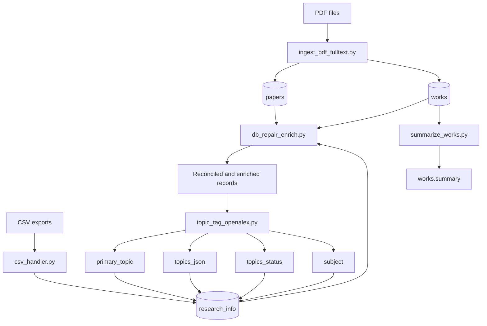

# research-llm Database

Database branch for building a local research paper knowledge base backed by SQLite. This branch ingests PDFs, loads publication metadata from CSV exports, repairs incomplete records, tags papers with OpenAlex topics, and generates summaries for downstream LLM and retrieval workflows.

## Overview

The codebase is organized as a set of standalone Python scripts that operate on a local SQLite database. It is designed for batch execution in a local environment rather than as a packaged application or web service.

At a high level, the pipeline does five things:

1. Ingest downloaded PDFs into the database
2. Load metadata from CSV exports into `research_info`
3. Repair and enrich incomplete rows across tables
4. Classify papers into OpenAlex topics
5. Generate summaries for stored full text

## Repository Goals

This branch appears intended to support a research assistant or chatbot workflow by building a structured local corpus that includes:

* PDF full text
* publication metadata
* generated summaries
* OpenAlex topic labels
* formatted data for fine tuning or retrieval workflows

## Architecture

The pipeline revolves around three main SQLite tables.

### `papers`

Stores publication level metadata such as title, authors, publication date, DOI, and arXiv ID.

### `works`

Stores PDF aligned work records, including file name, extracted full text, generated summary, and summarization state.

### `research_info`

Stores enriched metadata used for search, retrieval, researcher context, and topic tagging.

## Processing Layers

### Document extraction

* `pdf_pre.py`
* `ingest_pdf_fulltext.py`

### Metadata ingestion and reconciliation

* `csv_handler.py`
* `db_repair_enrich.py`

### Semantic enrichment

* `summarize_works.py`
* `model.py`
* `topic_tag_openalex.py`

### Training data preparation

* `llama_data_formatter.py`
* `fine_tune_llama_rag.py`

### Diagnostics

* `db_audit`

## End to End Pipeline

The main orchestrator is `run_pipeline.py`.

The execution order is:

1. `ingest_pdf_fulltext`
2. `csv_handler`
3. `db_repair_enrich`
4. `topic_tag_openalex`
5. `summarize_works`

### Why this order matters

* PDF ingestion creates `works.full_text`
* CSV ingestion adds external metadata
* repair and enrichment reconcile missing fields across tables
* topic tagging benefits from titles, summaries, or extracted text
* summarization runs on records still marked as unsummarized

## Expected Environment

This branch assumes a local development environment with:

* Python 3.x
* SQLite database already created
* local PDF directory already populated
* CSV exports already downloaded
* internet access for DOI and OpenAlex lookups in relevant stages
* optional GPU support for heavier model workloads

## Installation

Create a virtual environment and install the dependencies used by the scripts.

```bash
python -m venv .venv
source .venv/bin/activate
pip install pandas PyPDF2 torch transformers requests tqdm
```

Depending on your platform and workflow, you may also need additional packages used by specific scripts.

## Running the Pipeline

```bash
python run_pipeline.py
```

Useful options:

```bash
python run_pipeline.py --limit 100
python run_pipeline.py --skip-csv
python run_pipeline.py --skip-repair
python run_pipeline.py --skip-topics
python run_pipeline.py --skip-summarize
python run_pipeline.py --repair-t5
```

## Script Reference

### `run_pipeline.py`

Runs the full local pipeline.

Responsibilities:

* checks that the configured database exists
* verifies SQLite connectivity
* executes the pipeline in sequence
* supports skipping selected stages
* supports row limiting for heavy steps
* optionally enables a T5 based repair phase

Notes:

* database path is hard coded
* downstream scripts are expected to exist in the working directory
* subprocess based failures stop execution

### `pdf_pre.py`

Low level PDF extraction and cleaning utilities.

Main functions:

* `extract_raw_text_from_pdf(file_path)`
* `clean_text(text)`

Responsibilities:

* open PDFs with `PyPDF2`
* extract text page by page
* preserve basic page boundaries
* normalize and clean text for later processing

### `ingest_pdf_fulltext.py`

Scans a local PDF directory, extracts text, and inserts new rows into `works`.

Responsibilities:

* enumerate PDF files
* skip already ingested files by `file_name`
* extract and clean full text
* create placeholder rows in `papers`
* insert corresponding rows into `works`
* optionally create stubs in `research_info`

Inserted `works` fields include:

* `paper_id`
* `file_name`
* `full_text`
* empty summary
* `summary_status = 'unsummarized'`
* `progress = 0`

Limitations:

* file name uniqueness is assumed
* early `papers` metadata is placeholder only
* extraction quality depends on PDF structure and `PyPDF2`

### `csv_handler.py`

Loads several CSV exports and inserts standardized rows into `research_info`.

Responsibilities:

* load CSV files that exist from a configured list
* normalize column names
* drop duplicate columns
* standardize fields across heterogeneous exports
* concatenate frames
* keep rows with at least one PDF URL
* inspect the database schema dynamically
* insert rows into `research_info`

Important caveat:
This script points to `researchers_all.db`, while other scripts point to `syr_research_all.db`. Unless corrected, CSV ingestion may write to a different database than the rest of the pipeline.

### `database_handler.py`

SQLite helper functions for summarization workflows.

Responsibilities:

* fetch unsummarized rows from `works`
* update generated summaries
* preserve compatibility with older imports

The summarization contract uses rows where:

* `summary_status = 'unsummarized'`
* `progress = 0`
* `full_text` is not null and not empty

### `model.py`

Implements T5 based summarization and related model utilities.

Responsibilities likely include:

* loading the summarization model and tokenizer
* truncating or preparing input text
* generating abstractive summaries
* supporting downstream summary scripts and fine tuning workflows

### `summarize_works.py`

Runs the summarization pipeline over rows in `works` that are still unsummarized.

Typical flow:

* fetch candidate rows from `database_handler.py`
* summarize `full_text`
* store generated summaries back in the database
* update status fields to mark completion

### `db_repair_enrich.py`

Repairs and enriches database rows across tables.

This stage is responsible for filling missing fields and reconciling incomplete metadata using information already available in the database, parsed content, and optional model based extraction.

This is one of the most important normalization steps in the branch.

### `topic_tag_openalex.py`

Classifies papers into OpenAlex topics using the OpenAlex topic classification model and related metadata lookups.

Responsibilities:

* infer topics from title and abstract or equivalent text
* enrich topic labels using OpenAlex metadata
* write topic outputs back to `research_info`

Expected output fields include:

* `primary_topic`
* `topics_json`
* `topics_status`
* `subject`

### `llama_data_formatter.py`

Formats database content into training or retrieval ready records for LLaMA related workflows.

This script appears intended to transform local research records into a structured dataset suitable for fine tuning, RAG preparation, or prompt based experimentation.

### `fine_tune_llama_rag.py`

Utility for LLaMA fine tuning or retrieval augmented generation experiments using the processed research corpus.

## Data Flow



A simplified data flow looks like this:

```text
PDF files
  -> ingest_pdf_fulltext.py
  -> papers + works

CSV exports
  -> csv_handler.py
  -> research_info

papers + works + research_info
  -> db_repair_enrich.py
  -> reconciled and enriched records

reconciled text and metadata
  -> topic_tag_openalex.py
  -> OpenAlex topic fields in research_info

works.full_text
  -> summarize_works.py
  -> works.summary
```

##

## Recommended Setup 

To make this branch easier to maintain and run, the following changes would help:

1. move all paths into a `.env` file or central config module
2. unify the database filename across scripts
3. add schema migration or initialization scripts
4. define a single `requirements.txt`
5. convert the pipeline into a package with a clear entrypoint
6. add logging instead of relying mainly on print statements
7. document the expected table schema explicitly

##
